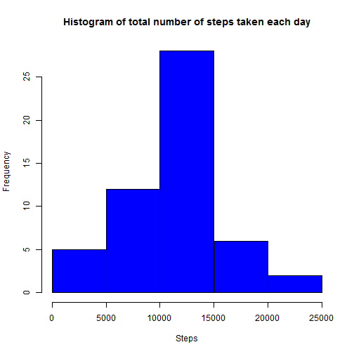

# Reproducible Research: Peer Assessment 1

## Loading and preprocessing the data


```r
echo = TRUE
setwd("D:\\coursera\\Reproducible Research\\Project\\RepData_PeerAssessment1")

if (!file.exists("activity.csv")) {
 if (!file.exists("activity.zip")){
  stop("file does not exist")
} else {
unzip("activity.zip")}
}

activity=read.csv("activity.csv",colClasses=c(NA,"Date",NA))
```

## What is mean total number of steps taken per day?
1. Histogram of total number of steps taken each day.

```r
DailyActivity=aggregate(steps~date, data=activity, FUN=sum,na.rm=FALSE, na.action=NULL)

hist(DailyActivity$steps,xlab="Steps",main="Histogram of total number of steps taken each day",col="blue")
```

 

2. Mean and Median total number of steps taken per day.

```r
summary(DailyActivity)
```

```
##       date                steps      
##  Min.   :2012-10-01   Min.   :   41  
##  1st Qu.:2012-10-16   1st Qu.: 8841  
##  Median :2012-10-31   Median :10765  
##  Mean   :2012-10-31   Mean   :10766  
##  3rd Qu.:2012-11-15   3rd Qu.:13294  
##  Max.   :2012-11-30   Max.   :21194  
##                       NA's   :8
```
From the Summary above, Mean  total number of steps taken per day was: 10766 and Median was: 10765

## What is the average daily activity pattern?

1. Time plot of 5 - min interval Vs Averaged accross all days.

```r
avgActivity=aggregate(steps~interval, data=activity, FUN=mean)

plot(avgActivity$interval,avgActivity$steps,type ="l",xlab="Interval",ylab="Steps",main="Time plot of 5 - min interval Vs Averaged accross all days")
```

 

2. The 5-minute interval, on average across all the days in the dataset, contains the maximum number of steps

```r
y=max(avgActivity$steps)

x=avgActivity[avgActivity$steps==y,1]
x
```

```
## [1] 835
```
The 5-minute interval, on average across all the days in the dataset, contains the maximum number of steps was: 835

## Imputing missing values

1. Calculate and report the total number of missing values in the dataset (i.e. the total number of rows with NAs)

```r
summary(activity)
```

```
##      steps            date               interval   
##  Min.   :  0.0   Min.   :2012-10-01   Min.   :   0  
##  1st Qu.:  0.0   1st Qu.:2012-10-16   1st Qu.: 589  
##  Median :  0.0   Median :2012-10-31   Median :1178  
##  Mean   : 37.4   Mean   :2012-10-31   Mean   :1178  
##  3rd Qu.: 12.0   3rd Qu.:2012-11-15   3rd Qu.:1766  
##  Max.   :806.0   Max.   :2012-11-30   Max.   :2355  
##  NA's   :2304
```
The Total number of missing values in the dataset was: 2304

2. Devise a strategy for filling in all of the missing values in the dataset.

  I will use the mean for the 5-minute interval to fill in the missing steps.

3. Create a new dataset that is equal to the original dataset but with the missing data filled in.

```r
z=aggregate(steps~interval, data=activity, FUN=mean)
getMeanSteps <- function(intv) {
    return(z[z$interval==intv,2])
}

activityfilled=activity


for (i in 1:dim(activityfilled)[1])
 if (is.na(activityfilled[i,1]))
  activityfilled[i,1]=getMeanSteps(activityfilled[i,3])


Dactivity=aggregate(steps~date, data=activityfilled, FUN=sum)
```
4.  Histogram of the total number of steps taken each day

```r
#Make a histogram of the total number of steps taken each day
hist(Dactivity$steps,xlab="Steps",main="histogram of the total number of steps taken each day",col="blue")
```

 

```r
# Mean and median total number of steps taken per day
summary(Dactivity)
```

```
##       date                steps      
##  Min.   :2012-10-01   Min.   :   41  
##  1st Qu.:2012-10-16   1st Qu.: 9819  
##  Median :2012-10-31   Median :10766  
##  Mean   :2012-10-31   Mean   :10766  
##  3rd Qu.:2012-11-15   3rd Qu.:12811  
##  Max.   :2012-11-30   Max.   :21194
```
Mean total number of steps taken per day was: 10,766 and Median was: 10,766

### Are there differences in activity patterns between weekdays and weekends?
1.  Creating a new factor variable in the dataset with two levels - "weekday" and "weekend" indicating whether a given date is a weekday or weekend day.

```r
for (i in 1:dim(activityfilled)[1])
 if (weekdays(activityfilled[i,2]) %in% c('Saturday','Sunday')) {
  activityfilled[i,"wd"]="weekend"
} else  {
  activityfilled[i,"wd"]="weekday"
  }
```

2.  Make a panel plot containing a time series plot (i.e. type = "l") of the 5-minute interval (x-axis) and the average number of steps taken, averaged across all weekday days or weekend days (y-axis).

```r
library(ggplot2)
```

```
## Use suppressPackageStartupMessages to eliminate package startup messages.
```

```r
#nei1=aggregate(Emissions~year+type, data=nei, FUN=sum)
avg=aggregate(steps~interval+wd, data=activityfilled, FUN=mean)
g=ggplot(avg,aes(interval,steps))
g=g+ geom_line() +facet_wrap(~ wd, ncol=1) + labs(title="Plot of the 5-minute interval and the average number of steps taken")  +labs(x="Interval",y="steps") 
g
```

 
